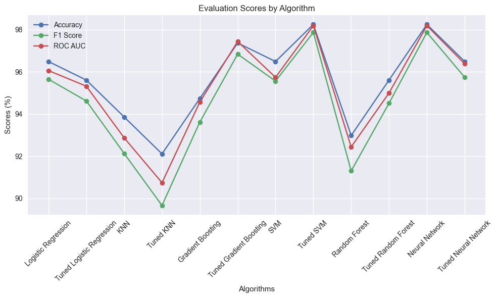

# breast-cancer-algorithm-benchmarks

This repository contains a comprehensive pipeline for **Evaluating Machine Learning Models** using the classic Breast Cancer dataset. The pipeline covers all stages from loading the dataset, exploring and analyzing the data, to preprocessing and training multiple machine learning algorithms. The performance of each algorithm is evaluated and compared using various metrics.

## Table of Contents
- [breast-cancer-algorithm-benchmarks](#breast-cancer-algorithm-benchmarks)
  - [Table of Contents](#table-of-contents)
  - [Introduction](#introduction)
  - [Dataset](#dataset)
  - [Installation](#installation)
  - [Usage](#usage)
  - [Data Exploration](#data-exploration)
  - [Data Preprocessing](#data-preprocessing)
  - [Model Training and Evaluation](#model-training-and-evaluation)
    - [Metrics Explanation](#metrics-explanation)
    - [Logistic Regression](#logistic-regression)
    - [K-Nearest Neighbors (KNN)](#k-nearest-neighbors-knn)
    - [Gradient Boosting](#gradient-boosting)
    - [Support Vector Machine (SVM)](#support-vector-machine-svm)
    - [Random Forest](#random-forest)
    - [Neural Network (Multilayer Perceptron)](#neural-network-multilayer-perceptron)
  - [Results](#results)
  - [License](#license)

## Introduction

This project aims to provide a detailed pipeline for evaluating the performance of various machine learning algorithms on a well-known dataset. By following this repository, users can understand the full process of machine learning evaluation, from data loading and preprocessing to model training and evaluation using different metrics.

## Dataset

The dataset used in this project is the **Breast Cancer Wisconsin (Diagnostic)** dataset. It can be downloaded from the [UCI Machine Learning Repository](https://archive.ics.uci.edu/ml/datasets/Breast+Cancer+Wisconsin+(Diagnostic)) or from [Kaggle](https://www.kaggle.com/datasets/uciml/breast-cancer-wisconsin-data).

## Installation

To get started with this project, clone the repository and install the required dependencies:

```bash
git clone https://github.com/kayckdelfino/breast-cancer-algorithm-benchmarks.git
cd breast-cancer-algorithm-benchmarks
cd src
pip install -r requirements.txt
```

## Usage

To execute the pipeline, open and run the [workflow.ipynb](./src/workflow.ipynb) notebook. This notebook will guide you through the entire process, including loading the dataset, data exploration, data preprocessing, model training, hyperparameter tuning, and model evaluation.

First, the Breast Cancer dataset will be imported, and an initial data inspection will be performed. Next, you will analyze and visualize the data to understand its structure and key characteristics. Following this, you will clean and preprocess the data to make it suitable for machine learning algorithms.

The notebook will then proceed to train multiple machine learning models, both with hyperparameter tuning and default settings. Each model's performance will be evaluated using metrics such as Accuracy, F1 Score, and ROC AUC.

Finally, the notebook will provide a comprehensive comparison of the models' performances, helping you identify the most effective algorithm for this use case.

## Data Exploration

The data exploration phase includes the following steps:

- Loading and visualization of the dataset
- Statistical analysis of the features
- Identifying missing values
- Visualizing the data distribution

## Data Preprocessing

The data preprocessing phase includes:

- Removing unsignificant features
- Encoding categorical variables
- Splitting the data into training and testing sets
- Feature scaling

## Model Training and Evaluation

In this phase, we train and evaluate multiple machine learning models. The performance of each model is evaluated using the following metrics:

- **Accuracy**
- **F1 Score**
- **ROC AUC**

### Metrics Explanation

- **Accuracy**: Accuracy is the ratio of correctly predicted observations to the total observations. It answers the question: "Of all the instances, how many were predicted correctly?" It is calculated as:

$$\text{Accuracy} = \frac{TP + TN}{TP + TN + FP + FN}$$

where $TP$ is the number of true positives, $TN$ is the number of true negatives, $FP$ is the number of false positives, and $FN$ is the number of false negatives.

- **F1 Score**: The F1 Score is the weighted average of Precision and Recall, two other metrics that won't be explored in this project. It takes both false positives and false negatives into account and is especially useful when the class distribution is imbalanced. The F1 Score is calculated as:

$$\text{F1 Score} = 2 \times \frac{\text{Precision} \times \text{Recall}}{\text{Precision} + \text{Recall}}$$

- **ROC AUC**: The ROC AUC (Receiver Operating Characteristic - Area Under the Curve) measures the ability of the model to distinguish between classes. The ROC curve plots the true positive rate (Recall) against the false positive rate (1 - Specificity). The AUC score ranges from 0 to 1, with 1 indicating perfect classification and 0.5 representing random guessing.

### Logistic Regression

Logistic regression is a fundamental statistical method used for modeling the relationship between a dependent variable and one or more independent variables, where the dependent variable is categorical. It is primarily used for classification tasks, predicting the probability of a binary outcome (1 or 0, true or false) based on one or more predictor variables. Logistic regression is valued for its simplicity, interpretability, and efficiency. For theoretical studies on logistic regression, you can refer to the following resources:

**References**:
- [Logistic Regression - Wikipedia](https://en.wikipedia.org/wiki/Logistic_regression)
- [Logistic Regression - Scikit Learn Documentation](https://scikit-learn.org/stable/modules/generated/sklearn.linear_model.LogisticRegression.html)

### K-Nearest Neighbors (KNN)

KNN is a simple, non-parametric method used for classification and regression tasks. It works by finding the k-nearest neighbors of a data point and making predictions based on their class or average value. For theoretical studies on KNN, you can refer to the following resources:

**References**:
- [K-Nearest Neighbors Algorithm - Wikipedia](https://en.wikipedia.org/wiki/K-nearest_neighbors_algorithm)
- [K-Nearest Neighbors Algorithm - Scikit Learn Documentation](https://scikit-learn.org/stable/modules/generated/sklearn.neighbors.KNeighborsClassifier.html)

### Gradient Boosting

Gradient Boosting is an ensemble learning method that builds a series of weak learners (usually decision trees) sequentially, with each subsequent model correcting errors made by the previous ones. For theoretical studies on Gradient Boosting, you can refer to the following resources:

**References**:
- [Gradient Boosting - Wikipedia](https://en.wikipedia.org/wiki/Gradient_boosting)
- [Gradient Boosting - Scikit Learn Documentation](https://scikit-learn.org/stable/modules/generated/sklearn.ensemble.GradientBoostingClassifier.html)

### Support Vector Machine (SVM)

SVM is a powerful supervised learning algorithm used for classification, regression, and outlier detection. It works by finding the hyperplane that best separates the classes in the feature space. For theoretical studies on SVM, you can refer to the following resources:

**References**:
- [Support Vector Machine - Wikipedia](https://en.wikipedia.org/wiki/Support_vector_machine)
- [Support Vector Machine - Scikit Learn Documentation](https://scikit-learn.org/stable/modules/generated/sklearn.svm.SVC.html)

### Random Forest

Random Forest is an ensemble learning method that constructs a multitude of decision trees at training time and outputs the class that is the mode of the classes (classification) or mean prediction (regression) of the individual trees. For theoretical studies on Random Forest, you can refer to the following resources:

**References**:
- [Random Forest - Wikipedia](https://en.wikipedia.org/wiki/Random_forest)
- [Random Forest - Scikit Learn Documentation](https://scikit-learn.org/stable/modules/generated/sklearn.ensemble.RandomForestClassifier.html)

### Neural Network (Multilayer Perceptron)

A Multilayer Perceptron (MLP) is a class of feedforward artificial neural network. For theoretical studies on neural networks, you can refer to the following resources:

**References**:
- [Multilayer Perceptron - Wikipedia](https://en.wikipedia.org/wiki/Multilayer_perceptron)
- [Multilayer Perceptron - Scikit Learn Documentation](https://scikit-learn.org/stable/modules/generated/sklearn.neural_network.MLPClassifier.html)

## Results

This section presents the performance metrics for each model, including accuracy, F1 score, and ROC AUC. Additionally, a visual representation of the evaluation results is provided below.



Upon analyzing the data, it can be concluded that the **standard Neural Network** and the **tuned SVM** demonstrated the **best performance** among all the algorithms evaluated. This conclusion was drawn after a comprehensive analysis of evaluation metrics, including accuracy, F1 Score, and ROC AUC, across all the machine learning algorithms applied in the project.

Both the standard Neural Network and the tuned SVM consistently outperformed other algorithms, delivering superior performance across all the metrics evaluated.

In summary, when choosing between these two top-performing models, as well as the others studied in this project, it is essential to consider factors such as performance, interpretability, and computational complexity. It is also important to test all the possibilities while taking into account the specific requirements and constraints of the problem at hand.

## License

This project is licensed under the **MIT License**. See the [LICENSE](./LICENSE) file for details.